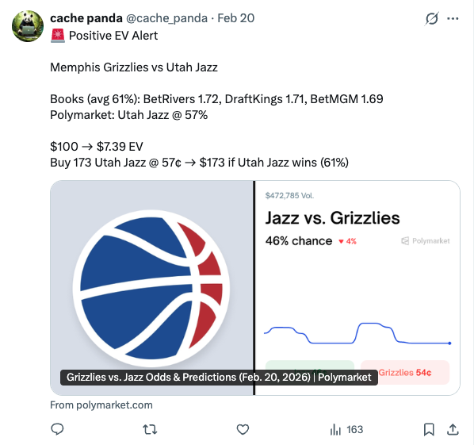
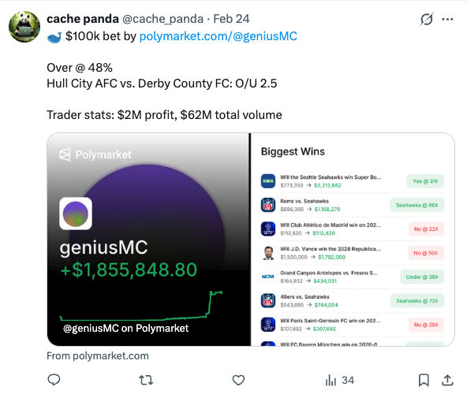
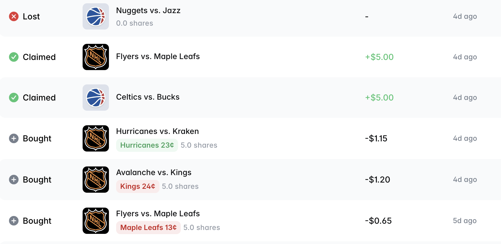

# Prediction Market Data Platform

Automated micro-batch data platform for detecting opportunities and tracking whale activity across prediction markets.

Live alerts posted to [@cache_panda](https://x.com/cache_panda).

<p align="center">
  
  
</p>

[](https://www.python.org/)
[](https://airflow.apache.org/)
[](https://www.docker.com/)


The platform monitors Polymarket and major sportsbooks, calculating expected value and detecting arbitrage opportunities in real-time.

## What It Does

- **Arbitrage Detection** - Finds risk-free profit opportunities across exchanges
- **Expected Value Analysis** - Identifies +EV bets where Polymarket/Kalshi odds are mispriced vs bookmaker consensus
- **Automated Trade Execution** - Places limit orders on Polymarket for +EV opportunities above 2% edge
- **Whale Monitoring** - Tracks trades >$50k from top 200 Polymarket traders
- **Automated Alerts** - Posts opportunities to Twitter as they're detected

## How It Works

The system runs two Airflow pipelines:

**Odds Monitor** (every 2 minutes)
1. Fetches latest odds from The Odds API (Polymarket, Kalshi, and 5 major sportsbooks)
2. Calculates true probabilities by removing bookmaker vig
3. Compares exchange prices against bookmaker consensus to find +EV opportunities
4. Detects arbitrage when opposite outcomes can be bet profitably across exchanges
5. Executes trades automatically on Polymarket for qualifying opportunities

**Whale Monitor** (every 5 minutes)
1. Pulls top 200 Polymarket traders by volume (cached 24hrs)
2. Fetches recent trades >$50k from the last 5 minutes
3. Posts significant whale activity to Twitter

## Data Architecture

The pipeline uses a three-layer approach:

**Raw Layer** - Immutable API responses stored as JSON
- Enables full pipeline replay and debugging

**Normalized Layer** - Flattened, structured data
- Parses JSON into relational tables with batch keys for idempotent runs

**Analytics Layer** - Calculated metrics and aggregations
- EV calculations, arbitrage detection, statistical analysis

All schemas are defined as SQL DDL files in `/tables/`, making the data model explicit and version-controlled.

## Trade Execution

The platform automatically executes trades on Polymarket when opportunities meet the following criteria:

**Execution Rules**
- Minimum EV edge: 2%
- Minimum bookmakers for consensus: 3
- Price range: 0.20 - 0.80 (avoids extreme probabilities)
- Max bets per outcome: 1 (prevents overexposure)
- Minimum bet size: $5
- Order type: Limit orders with 2-minute expiration

**How It Works**
1. `ev_strategy.py` queries the `odds_analysis` table for qualifying opportunities
2. Filters out events that have already started or hit bet limits
3. Calculates limit price: `bookmaker_consensus - 2%` (ensures edge even if filled)
4. `trade_executor.py` resolves the Polymarket token ID from the event slug
5. `polymarket_client.py` places the limit order via the CLOB API
6. All executions logged to `trade_executions` table with status and order ID

<p align="center">
  
</p>

**Configuration**

The strategy parameters can be adjusted in `dags/tasks/ev_strategy.py`:
```python
MIN_EV_EDGE = 0.02              # Minimum edge to trade
MAX_BETS_PER_OUTCOME = 1        # Risk limit per outcome
MIN_BET_SIZE = 5.0              # Minimum order size
MIN_LIMIT_PRICE = 0.2           # Avoid extreme probabilities
MAX_LIMIT_PRICE = 0.80
MIN_BOOKMAKERS = 3              # Minimum for consensus
```

## Tech Stack

- **Orchestration**: Apache Airflow (TaskFlow API)
- **Database**: SQLite (will be PostgreSQL in the future)
- **APIs**: The Odds API, Polymarket Data API, Twitter API
- **Deployment**: Docker Compose

## Setup

1. Clone the repository
```bash
git clone https://github.com/yourusername/prediction-market-data-platform.git
cd prediction-market-data-platform
```

2. Create `.env` file with API keys
```bash
THE_ODDS_API_KEYS=your_key1,your_key2
TWITTER_API_KEY=your_key
TWITTER_API_SECRET=your_secret
TWITTER_ACCESS_TOKEN=your_token
TWITTER_ACCESS_TOKEN_SECRET=your_token_secret
POLYMARKET_API_KEY=your_key
POLYMARKET_API_SECRET=your_secret
POLYMARKET_API_PASSPHRASE=your_passphrase
POLYMARKET_PRIVATE_KEY=your_private_key
POLYMARKET_FUNDER_ADDRESS=your_funder_address
```

3. Start the platform
```bash
docker-compose up -d
```

4. Access Airflow UI at `http://localhost:8080`

## Testing

```bash
pytest tests/
```

Unit tests cover core transformation logic in task functions.