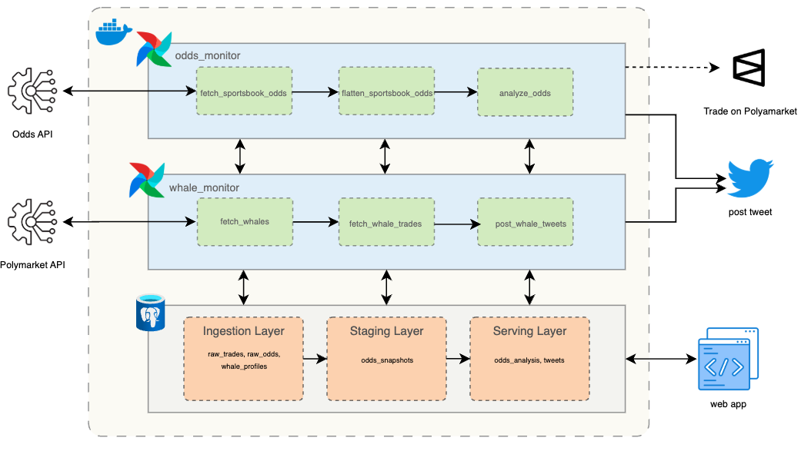

# Prediction Market Data Platform

Automated micro-batch data platform for detecting opportunities and tracking whale activity across prediction markets.

Live alerts posted to [@cache_panda](https://x.com/cache_panda).

[](https://www.python.org/)
[](https://airflow.apache.org/)
[](https://www.docker.com/)




The platform monitors Polymarket and major sportsbooks, calculating expected value and detecting arbitrage opportunities in real-time.

## What It Does

- **Arbitrage Detection** - Finds risk-free profit opportunities across exchanges
- **Expected Value Analysis** - Identifies +EV bets where Polymarket/Kalshi odds are mispriced vs bookmaker consensus
- **Whale Monitoring** - Tracks trades >$10k from top 200 Polymarket traders
- **Automated Alerts** - Posts opportunities to Twitter as they're detected

## How It Works

The system runs two Airflow pipelines every 15 minutes:

**Odds Monitor**
1. Fetches latest odds from The Odds API (Polymarket, Kalshi, and 5 major sportsbooks)
2. Calculates true probabilities by removing bookmaker vig
3. Compares exchange prices against bookmaker consensus to find +EV opportunities
4. Detects arbitrage when opposite outcomes can be bet profitably across exchanges
5. Posts top opportunities to Twitter

**Whale Monitor**
1. Pulls top 200 Polymarket traders by volume (cached 24hrs)
2. Fetches recent trades >$10k from the last 15 minutes
3. Posts significant whale activity to Twitter

## Data Architecture

The pipeline uses a three-layer approach:

**Raw Layer** - Immutable API responses stored as JSON
- Enables full pipeline replay and debugging

**Normalized Layer** - Flattened, structured data
- Parses JSON into relational tables with batch keys for idempotent runs

**Analytics Layer** - Calculated metrics and aggregations
- EV calculations, arbitrage detection, statistical analysis

All schemas are defined as SQL DDL files in `/tables/`, making the data model explicit and version-controlled.

## Tech Stack

- **Orchestration**: Apache Airflow (TaskFlow API)
- **Database**: SQLite (will be PostgreSQL in the future)
- **APIs**: The Odds API, Polymarket Data API, Twitter API
- **Deployment**: Docker Compose

## Setup

1. Clone the repository
```bash
git clone https://github.com/yourusername/prediction-market-data-platform.git
cd prediction-market-data-platform
```

2. Create `.env` file with API keys
```bash
THE_ODDS_API_KEY=your_key
TWITTER_API_KEY=your_key
TWITTER_API_SECRET=your_secret
TWITTER_ACCESS_TOKEN=your_token
TWITTER_ACCESS_TOKEN_SECRET=your_token_secret
```

3. Start the platform
```bash
docker-compose up -d
```

4. Access Airflow UI at `http://localhost:8080`

## Testing

```bash
pytest tests/
```

Unit tests cover core transformation logic in task functions.